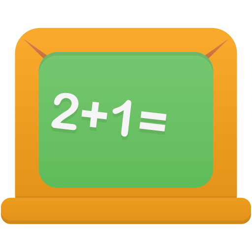

Eğitim Paint Uygulaması Dokümantasyonu
========================================

.. toctree::
   :maxdepth: 2
   :caption: İçindekiler:

   giris
   kurulum
   kullanim
   gelistirme
   api
   ornekler
   sikca_sorulan_sorular

Hoş Geldiniz!
-------------

**Eğitim Paint Uygulaması**, Python programlama öğrenenler için tasarlanmış, Türkçe arayüzlü bir çizim uygulamasıdır. Bu uygulama, Tkinter kütüphanesi kullanılarak geliştirilmiş olup, temel çizim araçları ve kullanıcı dostu arayüz sunar.

Özellikler
----------

* **Türkçe Arayüz**: Tamamen Türkçe menü sistemi ve mesajlar
* **Çizim Araçları**: Kalem, fırça, silgi ve şekil çizim araçları
* **Eğitim Odaklı**: Python GUI programlama öğrenimi için ideal
* **Cross-Platform**: Windows, macOS ve Linux'ta çalışır
* **Açık Kaynak**: MIT lisansı altında geliştirilmiştir

Hızlı Başlangıç
----------------

.. code-block:: bash

   # Projeyi klonlayın
   git clone https://github.com/bahattinyunuscetin/python_paint_project.git
   
   # Klasöre girin
   cd python_paint_project
   
   # Uygulamayı çalıştırın
   python demo1/main.py

Gereksinimler
-------------

* Python 3.6 veya üzeri
* Tkinter (Python ile birlikte gelir)
* Pillow (PIL) kütüphanesi
* Pyglet kütüphanesi

Kurulum
-------

.. code-block:: bash

   # Gerekli kütüphaneleri yükleyin
   pip install Pillow pyglet

   # Sanal ortam oluşturun (önerilen)
   python -m venv .venv
   source .venv/bin/activate  # Unix/Mac
   .venv\Scripts\activate     # Windows

Kullanım
--------

Uygulama başlatıldığında:

1. **Hoş geldin mesajı** görüntülenir
2. **Ana pencere** açılır
3. **Çizim araçları** sol tarafta bulunur
4. **Menü sistemi** üst kısımda yer alır
5. **Canvas** ortada çizim yapılır

Çizim Araçları
--------------

* **Kalem**: Serbest çizim için
* **Fırça**: Farklı boyutlarda çizim için
* **Silgi**: Çizim silmek için
* **Şekil**: Geometrik şekiller çizmek için

Menü Sistemi
------------

* **Dosya**: Aç, kaydet, farklı kaydet
* **Düzenle**: Geri al, temizle
* **Ekle**: Resim ekleme
* **Kalem**: Kalem ayarları
* **Fırça**: Fırça ayarları
* **Silgi**: Silgi ayarları
* **Renk**: Renk seçimi
* **Yardım**: Hakkında, yardım, geliştirici

Geliştirme
----------

Bu proje açık kaynak kodludur ve katkılarınızı bekler! Geliştirme için:

* `CONTRIBUTING.md` dosyasını inceleyin
* Issue açın veya mevcut issue'lara katkıda bulunun
* Pull Request gönderin
* Dokümantasyonu geliştirin

Lisans
------

Bu proje `MIT License` altında lisanslanmıştır. Detaylar için `LICENSE` dosyasını inceleyin.

İletişim
--------

* **GitHub**: https://github.com/bahattinyunuscetin/python_paint_project
* **Issues**: https://github.com/bahattinyunuscetin/python_paint_project/issues
* **Discussions**: https://github.com/bahattinyunuscetin/python_paint_project/discussions

Katkıda Bulunanlar
------------------

* **Bahattin Yunus Çetin** - Ana geliştirici
* **Python Topluluğu** - İlham ve destek
* **Tkinter Geliştiricileri** - GUI kütüphanesi
* **Açık Kaynak Topluluğu** - Katkılar ve öneriler

---

**🎨 Eğitim Paint Uygulaması ile Python GUI programlamayı öğrenin!**

.. raw:: html

   

       <a href="https://github.com/bahattinyunuscetin/python_paint_project" 
          style="background-color: #2980B9; color: white; padding: 10px 20px; 
                 text-decoration: none; border-radius: 5px; font-weight: bold;">
           ⭐ GitHub'da Star Verin
       </a>
   

